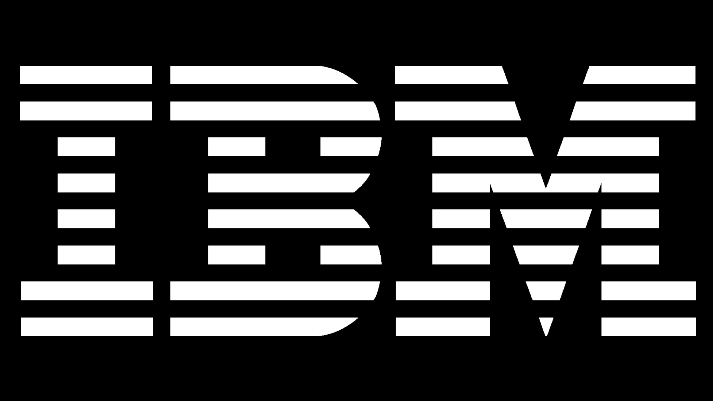
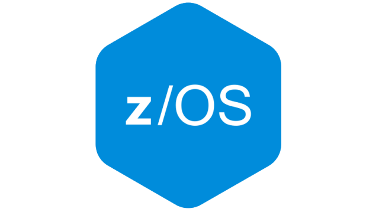
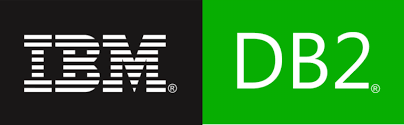
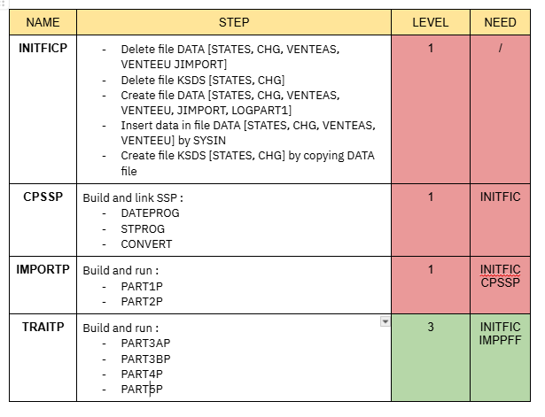
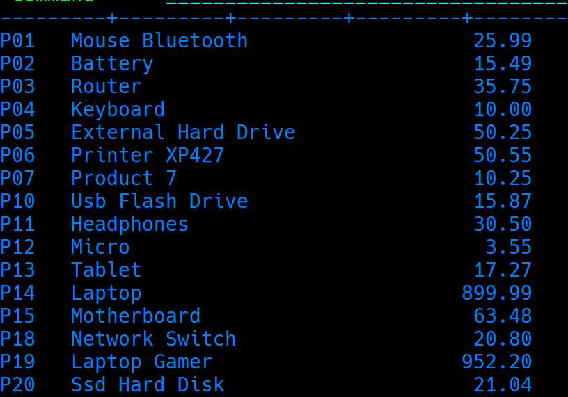

<h1 style="text-align: center; font-weight: bold; font-size: 38px">No Mainframe, No Life</h1>

## **Overview**

Join us as we embark on a data-driven adventure to transform **AJCFRAME company** operations. By harnessing the power of DB2 and advanced data integration techniques, we'll create a robust and scalable data infrastructure. This project will lay the foundation for future innovations, empowering AJCFRAME to make data-driven decisions that drive growth and success.

	
	

## **Prerequisites: Setting the Stage for Success**

### **Essential Tools and Access:**

<i>To embark on this data-driven adventure, ensure you have the following prerequisites:</i>

- **Mainframe Access:**

  - The **WC3270** -> A reliable terminal emulator to connect to the mainframe system, coupled to the **ISPF** utility
  

  - Necessary Authorizations: Obtain appropriate permissions to access the required data and execute the necessary jobs.

- **Data Programs and Utilities:**

  - Data Programs: As a starter, you will need the initial data contained in the [data-starter folder](./assets)  
  Familiarize yourself with the specific programs and data used to initialize the project. See [Initialisation](#initialization)  

  - Utilities: Ensure access to essential **JCL** utilities like **SORT, IEBGENER, IDCAMS**    and a **COBOL** Compiler.

- **A Well-Brewed Cup of Coffee**

  :coffee: A steady supply of caffeine can be a lifesaver during long coding sessions and debugging marathons.

**Technical Skills:**

  
  
  

- **COBOL** A solid understanding of COBOL programming is essential for working with mainframe systems and their data.

- **JCL** Knowledge of Job Control Language is crucial for executing jobs and managing data flows.
   JCL is here to <i>describe to the operating system (z/OS) the work that has to be done, and the resources required to do that work</i>
   
- **DB2** Familiarity with DB2 database concepts and SQL is necessary for data manipulation and query operations.

## **First things first**

### **Database Setup**

In **ISPF** main menu, type **m.11.1**, you will enter in the **SPUFI** (SQL Processing Using File Input) tool, used for executing the SQL queries directly on a DB2 database. 
Inside SPUFI you can import [BDDORDER.sql](./APIX/SQL/BDDORDER.sql) in order to generate the 1st database. 
Similarly, repeat the process with [BDDPARTS.sql](./APIX/SQL/BDDPARTS.sql) 
After running this 2 SQL script with SPUFI, your DB databases are ready and eager to receive some data.

### **Mainframe Setup**

Here's a list of the **4 JCL programs** in charge of running the **entire project**

In order to properly setup, when you are at the root of the project, head over to `APIX/SOURCE/JCL` folder.

-> The first **JCL** file you need to submit on Z/OS is the [initficp.jcl](./APIX/SOURCE/JCL/initficp.jcl) - as the name suggests, this **Job Control Language** file builds up all data files to start the project on a clean basis.

-> The second **JCL** is called [cpssp.jcl](./APIX/SOURCE/JCL/cpsspp.jcl) - this one will compile and link-edit all the sub-programs needed by the main programs during further stages. 
All those sub-programs will be ready-to-go in your `APIX.COBOL.LOAD` dataset.

##  **Part one / Part two - Import new products / Insert sales**

#### Key Objectives

- Efficient Data Ingestion: Develop a robust and scalable data ingestion pipeline  to  swiftly import product data into the DB2 database.
- Data Quality Assurance: Implement rigorous **data validation** and cleaning procedures to maintain data accuracy and consistency.
- Seamless Integration: Ensure smooth integration of new products with existing data structures.

#### **Launching part1 && part2**

Simply submit to z/OS the Job written in [importp.jcl](./APIX/SOURCE/JCL/importp.jcl)
**This z/OS job will:**

- import new products in DB2
- convert all products with foreign currencies in $usd
- generate a log file `LOGPART1`, listing all CSV lines which were rejected by DB2, and **why** they were rejected

The core **COBOL** codes for **part one** are located in [part1p.cob](./APIX/SOURCE/COBOL/part1p.cob), and in sub-program [convert.cob](./APIX/SOURCE/COBOL/convert.cob).  
The `part1p.cob` is intended to import all new product provided by AJCFRAME catalog, and convert foreign moneys to $USD dollars via the sub-program [convert.cob](./APIX/SOURCE/COBOL/convert.cob)  
The `convert.cob` sub-routine uses the power of **VSAM - KSDS** file, we created a indexed-list of all currency codes and their respective change rate. The Key Sequenced Data Set (KSDS) allows an efficient "search & convert" for the foreign money.

The core **COBOL** codes for **part two** are located in [part2.cob](./APIX/SOURCE/COBOL/part2p.cob) and [convdate.cob](./APIX/SOURCE/COBOL/convdate.cob). 
The `part2p.cob` is intended to import new sales from Asia and Europe , and update the balance of customers - its main logic performs a **sequential and synchronized** read on the 2 sales files **VENTESEU.txt** and **VENTESAS.txt**. It ensures all orders are accounted for in a single pass. 
- Key benefits : 
   - **Efficiency**  By reading both files in order of their keys (e.g., order number), it minimizes the need for backtracking or redundant searches.
   - **Data Consistency**: Ensures that related records from both files are processed together, preserving the **integrit** of combined   sales data.
   - **Simplified Logic** The sequential approach reduces complexity in merging data, making the code easier to read, maintain, and debug.
   - **Reduced Resource Use** Sequential access requires fewer I/O operations compared to random reads, which would be especially valuable in future operations of AJCFRAME.
   
`convdate.cob` simply format the data in the US format. There again, we call a subroutine in the principle of "separation of concern", modularity, and COBOL-way-of-life, uh.

## **Part three / part four / part five**

#### Key Objectives

**Part 3**
- Invoice generation: Produce an invoice for each order.
- Data optimization: minimize computing resource by **avoiding frequent database table access**
- Data export: extract and consolidate all orders information -> especially to avoid those frequent database access mentionned line above.

**Part 4**
- Data collaboration: prepare AJCFRAME's data for a market research collaborator
- Sales Ranking: Generate an XML file highlighting the most sold products
- XML compliance

**Part 5**
- Summarize Quantities of parts by supplier
- Informative visualization

#### **Launching part3 && part4 && part5**

Simply submit to z/OS the Job in [traitp.jcl](./APIX/SOURCE/JCL/traitp.jcl)
**This z/OS job will:**

- In a single access to DB2 database -> extract and consolidate all orders informations in a `APIXX.AJC.EXTRACT.DATA` dataset.
- Generate a bills-listing file for all these orders in a `APIXX.AJC.FACTURES.DATA`.
- Rank the products by best sales and generate an XML file `APIXX.AJC.XML.DATA` for market sales partner of AJCFRAME.
- Summarize each quantities of parts by supplier (From second database [BDDORDER.sql](./APIX/SQL/BDDORDER.sql))

The core logic for part **part three** are located in  [part3ap.cob](./APIX/SOURCE/COBOL/part3ap.cob) and [part3bp.cob](./APIX/SOURCE/COBOL/part3bp.cob).  
The subroutines [convdate.cob](./APIX/SOURCE/COBOL/convdate.cob) and [dataprog.cob](./APIX/SOURCE/COBOL/dateprog.cob) and [stprog.cob](./APIX/SOURCE/COBOL/stprog.cob) are involved in this third step.  
`stprog.cob` uses again the power of **KSDS** to resolve a state code on 2 chars to a full state name.

Finally, **part4** main brick is in [part4p.cob](./APIX/SOURCE/COBOL/part4p.cob) and **part5** - no surprise - is handled by [part5p.cob](./APIX/SOURCE/COBOL/part5p.cob)

## **Some examples**

If everything goes well for you - and if not we are here to help , here's what you should get for each part:
- **part1 && part2**
  
  running `select * from products;* in **SPUFI** tool should output you the list of newly inserted products, with their usd price:
 

	

  similarly, using SPUFI, and queries like `select balance from customers;` and `select * from orders where o_no between 500 and 505` should output respectively:

  results to come baby !

## **Authors**

Rémi, Mathieu && Hinkoko

 

