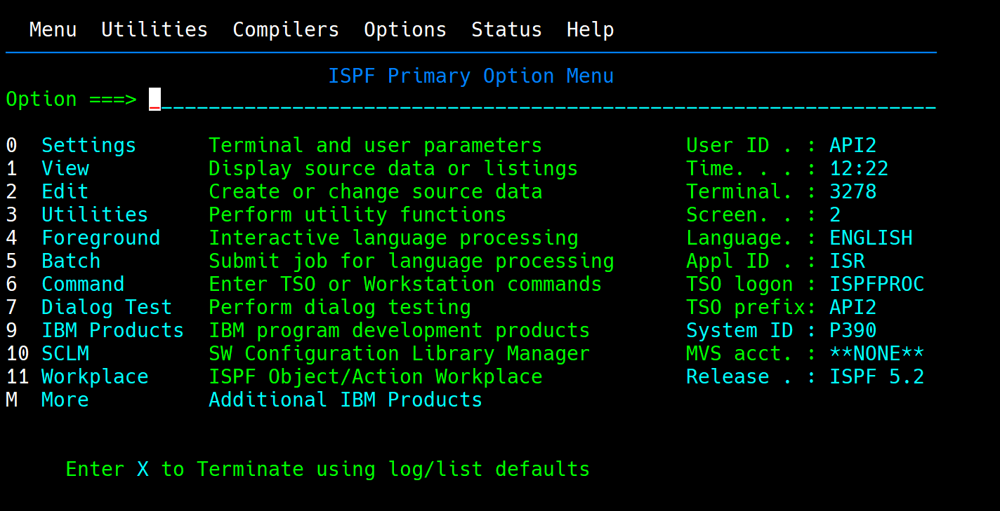

<h1 style="text-align: center; font-weight: bold; font-size: 38px">No Mainframe, No Life</h1>

## **Overview**

Join us as we embark on a data-driven adventure to transform **AJCFRAME company** operations. By harnessing the power of DB2 and advanced data integration techniques, we'll create a robust and scalable data infrastructure. This project will lay the foundation for future innovations, empowering AJCFRAME to make data-driven decisions that drive growth and success.

	

## **Prerequisites: Setting the Stage for Success**

### **Essential Tools and Access:**

<i>To embark on this data-driven adventure, ensure you have the following prerequisites:</i>

- **Mainframe Access:**

  - The **WC3270** -> A reliable terminal emulator to connect to the mainframe system, coupled to the **ISPF** utility
  

  - Necessary Authorizations: Obtain appropriate permissions to access the required data and execute the necessary jobs.

- **Data Programs and Utilities:**

  - Data Programs: As a starter, you will need the initial data contained in the [data-starter folder](./assets)  
  Familiarize yourself with the specific programs and data used to initialize the project. See [Initialisation](#initialization)  

  - Utilities: Ensure access to essential **JCL** utilities like **SORT, IEBGENER, IDCAMS**    and a **COBOL** Compiler.

- **A Well-Brewed Cup of Coffee**

  :coffee: A steady supply of caffeine can be a lifesaver during long coding sessions and debugging marathons.

**Technical Skills:**

  

- **COBOL** A solid understanding of COBOL programming is essential for working with mainframe systems and their data.

- **JCL** Knowledge of Job Control Language is crucial for executing jobs and managing data flows.
- **DB2** Familiarity with DB2 database concepts and SQL is necessary for data manipulation and query operations.

##  **Part one - import new products**

#### Key Objectives:

- Efficient Data Ingestion: Develop a robust and scalable data ingestion pipeline   to   swiftly import product data into the DB2 database.
- Data Quality Assurance: Implement rigorous data validation and cleaning procedures to maintain data accuracy and consistency.
- Seamless Integration: Ensure smooth integration of new products with existing data structures.

To realize

## **Part two - import new sales**

## **Part three - export all and edit bills**

## **Part four - XML migration**

## **Part 5 - products && pieces analysis**

## **Authors**

Rémi, Mathieu && Hinkoko

 

